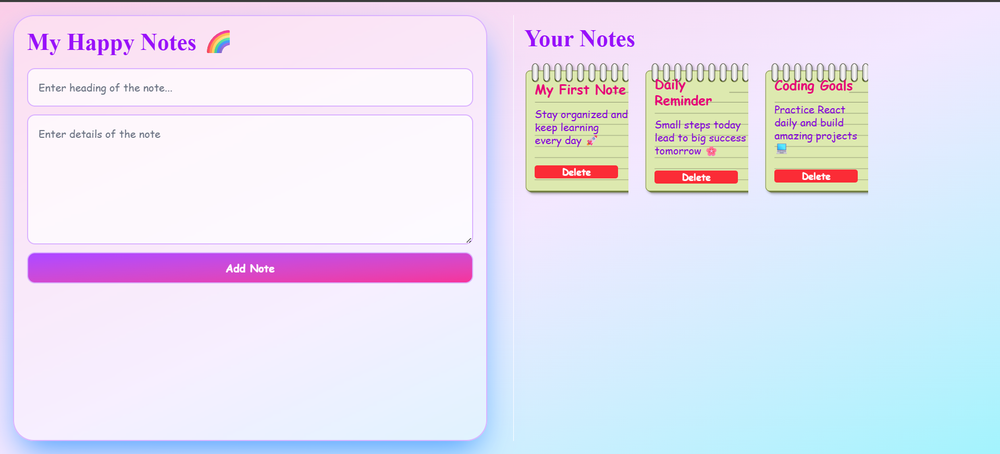

# 🌈 My Happy Notes (React + Vite)

A simple and aesthetic note-taking web application built using **React JS with Vite**.
It allows users to quickly add and delete notes with a clean and responsive interface.

🔗 **Live Demo:** https://ndnoteapp.netlify.app/

---

## ✨ Features

* 📝 Add notes with title and details
* 🗑️ Delete notes instantly
* ⚛️ Built using React (functional components & hooks)
* ⚡ Powered by Vite for fast performance
* 🎨 Beautiful and user-friendly UI

---

## 🖼️ Preview

<p align="center">
  
</p>

---
## 🛠️ Technologies Used

* ⚛️ React JS
* ⚡ Vite
* HTML5
* CSS3
* JavaScript (ES6+)

---

## 🚀 Getting Started

### 1️⃣ Clone the repository

```bash id="a1b2c3"
git clone https://github.com/nidhi-kumari10/note-project.git
cd note-project
```

### 2️⃣ Install dependencies

```bash id="d4e5f6"
npm install
```

### 3️⃣ Run the development server

```bash id="g7h8i9"
npm run dev
```

Then open:

```id="j1k2l3"
http://localhost:5173
```

---

## 📁 Project Structure

```id="m4n5o6"
📦 Note-project
 ┣ 📂 src
 ┃ ┣ 📜 App.jsx
 ┃ ┣ 📜 main.jsx
 ┃ ┗ 📜 index.css
 ┣ 📜 index.html
 ┣ 📜 package.json
 ┣ 📜 vite.config.js
 ┗ 📜 README.md
```

---

## 🙌 Author

Made with ❤️ by Kumari Nidhi

---
